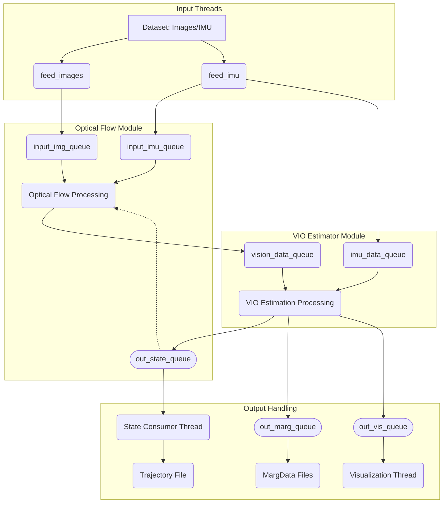

# Basalt VIO 코드베이스 튜토리얼

이 튜토리얼은 Basalt VIO 코드베이스 구조, 데이터 흐름 및 핵심 알고리즘에 대한 개요를 제공합니다.

## 1. 개요

Basalt는 카메라와 관성 측정 장치(IMU)를 사용하여 장치(예: XR 하드웨어)의 움직임을 추정하도록 설계된 시각-관성 오도메트리(VIO) 시스템입니다. 키프레임을 사용하는 긴밀하게 결합된(tightly-coupled) 최적화 기반 접근 방식을 사용합니다.

## 2. 코드 구조

코드베이스는 주로 헤더 파일을 위한 `include/basalt`와 구현 파일을 위한 `src`로 구성됩니다. 주요 모듈은 다음과 같습니다:

*   `vi_estimator`: 핵심 VIO 상태 추정 로직.
*   `optical_flow`: 특징점 검출 및 추적.
*   `calibration`: 카메라 및 IMU 보정 모델 및 도구.
*   `utils`: 공통 유틸리티, 설정 및 데이터 구조.
*   `io`: 데이터셋 로딩 및 저장 기능.
*   `linearization`: 최적화 문제 공식화와 관련된 구성 요소.
*   실행 파일 대상(예: `vio.cpp`, `calibrate.cpp`): 시스템의 다른 부분을 실행하기 위한 주 진입점.

## 3. 데이터 흐름 및 처리 파이프라인

이 시스템은 효율적인 데이터 처리를 위해 여러 스레드와 메시지 큐를 사용하여 작동합니다. 일반적으로 `vio.cpp`와 같은 실행 파일에 의해 조정되는 주요 처리 파이프라인은 다음과 같습니다:

1.  **데이터 로딩:**
    *   카메라 보정(`Calibration`) 및 VIO 설정(`VioConfig`)을 로드합니다.
    *   `DatasetIoInterface`를 사용하여 데이터셋(이미지 및 IMU 측정값)을 로드합니다(예: EuRoC MAV 또는 ROS bag 형식).
2.  **초기화:**
    *   `OpticalFlow` 인스턴스(예: `FrameToFrameOpticalFlow`)를 생성합니다.
    *   `VioEstimator` 인스턴스(VIO의 경우 `SqrtKeypointVioEstimator` 또는 VO의 경우 `SqrtKeypointVoEstimator`)를 생성합니다.
    *   이러한 구성 요소를 연결하는 입력 및 출력 큐를 설정합니다.
3.  **입력 스레드:**
    *   전용 스레드(`feed_images`)는 데이터셋에서 이미지 데이터를 읽어 `OpticalFlow` 모듈의 입력 큐(`input_img_queue`)로 푸시합니다.
    *   다른 스레드(`feed_imu`)는 IMU 데이터를 읽어 `OpticalFlow`(`input_imu_queue`) 및 `VioEstimator`(`imu_data_queue`) 입력 큐 모두로 푸시합니다.
4.  **Optical Flow 처리:**
    *   `OpticalFlow` 모듈은 별도의 스레드에서 자체 처리 루프를 실행합니다.
    *   `input_img_queue`에서 이미지를 소비합니다.
    *   특징점 모션을 예측하기 위해 `input_imu_queue`에서 IMU 데이터를 소비합니다.
    *   특징점 검출 및 추적을 수행합니다(섹션 4.1 참조).
    *   결과(`OpticalFlowResult`, 추적된 키포인트 포함)를 `VioEstimator`의 비전 입력 큐(`vision_data_queue`)로 푸시합니다.
5.  **VIO 추정:**
    *   `VioEstimator`는 처리 루프를 실행합니다(내부적으로 TBB를 사용하여 다중 스레드일 가능성이 높음).
    *   `imu_data_queue`에서 IMU 데이터를, `vision_data_queue`에서 optical flow 결과를 소비합니다.
    *   번들 조정(bundle adjustment)을 사용하여 상태 추정을 수행합니다(섹션 4.2 참조).
    *   추정된 상태(`PoseVelBiasState`)를 `out_state_queue`로 출력합니다.
    *   시각화 데이터(`VioVisualizationData`)를 `out_vis_queue`로 출력합니다(GUI가 활성화된 경우).
    *   마지널라이제이션 데이터(`MargData`)를 `out_marg_queue`로 출력합니다(저장이 활성화된 경우).
6.  **출력 처리:**
    *   상태 소비자 스레드는 로깅 또는 궤적 저장을 위해 `out_state_queue`에서 추정된 상태를 읽습니다.
    *   시각화 스레드(`show_gui`가 true인 경우)는 Pangolin을 사용하여 `out_vis_queue`에서 데이터를 읽고 시스템 상태(이미지, 특징점, 궤적, 플롯)를 표시합니다.

## 4. 핵심 알고리즘

### 4.1 이미지 처리 (Optical Flow)

`OpticalFlow` 모듈(예: `FrameToFrameOpticalFlow`)은 연속적인 프레임 간에 두드러진 이미지 특징점을 검출하고 추적하는 역할을 합니다.

*   **이미지 피라미드:** 다양한 특징점 스케일과 움직임을 처리하기 위해 다중 해상도 이미지 피라미드를 구축합니다.
*   **특징점 검출:** 각 프레임에서 일반적으로 그리드 기반으로 적절한 검출기를 사용하여 새로운 특징점(코너)을 검출합니다. 그리드 셀 내에서 비최대 억제(Non-maximal suppression)가 적용됩니다.
*   **예측:** IMU 데이터(사용 가능한 경우)와 이전 추정된 모션을 사용하여 현재 프레임에서 특징점의 예상 위치를 예측합니다. 이는 추적을 위한 초기 추측값을 제공합니다.
*   **추적:** 패치 기반의 반복적인 KLT 스타일 추적기는 피라미드 레벨에 걸쳐 이전 프레임과 현재 프레임의 패치 간의 광도 오차(photometric error)를 최소화하여 특징점 위치를 정밀화합니다. 전방-후방 추적 검사는 강건성을 보장합니다.
*   **스테레오 매칭:** 다중 카메라 시스템의 경우, 암시적으로 에피폴라 제약 조건을 활용하여 동일한 예측 및 추적 메커니즘을 사용하여 카메라 쌍 간에 특징점을 매칭합니다.
*   **출력:** 모듈은 현재 타임스탬프에서 각 카메라에 대해 성공적으로 추적된 키포인트의 위치를 포함하는 `OpticalFlowResult`를 출력합니다.

### 4.2 시각-관성 오도메트리 (VIO Estimator)

`VioEstimator` 모듈(예: `SqrtKeypointVioEstimator`)은 센서 융합 및 상태 추정을 수행합니다.

*   **알고리즘 유형:** 키프레임 기반, 슬라이딩 윈도우 그래프 최적화 (Bundle Adjustment).
*   **상태:** 상태 벡터는 일반적으로 다음을 포함합니다:
    *   윈도우 내 키프레임의 카메라 포즈 (`SE3`).
    *   IMU의 속도.
    *   IMU 바이어스 (자이로스코프 및 가속도계).
    *   추적된 랜드마크(특징점)의 3D 위치.
*   **최적화:** 다양한 요인에서 발생하는 제곱 오차의 합을 최소화하기 위해 비선형 최소 제곱 문제가 공식화됩니다:
    *   **시각 재투영 오차:** 관찰된 2D 특징점 위치와 추정된 포즈를 사용하여 3D 랜드마크를 키프레임에 투영하여 예측된 위치 간의 차이. 강건한 Huber 비용 함수가 종종 사용됩니다.
    *   **IMU 사전적분 오차:** 연속적인 키프레임 간의 IMU 측정값을 적분하여 파생된 제약 조건. 이러한 요인은 포즈, 속도 및 바이어스를 연결합니다.
    *   **마지널라이제이션 사전 확률:** 슬라이딩 윈도우에서 마지널라이즈된(제거된) 상태 및 랜드마크로부터 누적된 정보를 나타내는 요인.
*   **해결기:** 최적화 문제는 Levenberg-Marquardt (LM) 알고리즘을 사용하여 반복적으로 해결됩니다. 각 LM 반복 내의 선형 시스템은 일반적으로 Schur complement에 대한 QR 또는 Cholesky (LDLT) 분해와 같은 희소 행렬 기법을 사용하여 효율적으로 해결됩니다. 클래스 이름의 "Sqrt"는 수치적 안정성을 위해 제곱근 정보/공분산 표현을 사용함을 시사합니다.
*   **마지널라이제이션:** 고정된 크기의 최적화 윈도우를 유지하기 위해 오래된 키프레임과 랜드마크가 제거(마지널라이즈)됩니다. 그들의 기여는 윈도우 내의 나머지 변수를 제약하는 사전 확률 요인(`MargLinData`)으로 요약됩니다.
*   **키프레임 관리:** 시간, 모션 및 특징점 추적 품질과 같은 요인을 고려하여 윈도우에 추가할 새 키프레임(`take_kf`)을 생성할 시기를 결정하는 휴리스틱이 사용됩니다.

## 5. 코드 탐색 팁

소스 코드를 처음 접하는 사람들을 위한 권장 시작 지점은 다음과 같습니다:

*   **주 실행 파일 (`src/vio.cpp`):** `src/vio.cpp`의 `main` 함수에서 시작하십시오. 이는 전체 설정, 인수 구문 분석, 객체 인스턴스화(Dataset IO, Optical Flow, VIO Estimator), 스레드 생성 및 주 애플리케이션 루프(GUI가 활성화된 경우)를 보여줍니다.
*   **팩토리:** `OpticalFlowFactory`(`src/optical_flow/optical_flow.cpp`) 및 `VioEstimatorFactory`(`src/vi_estimator/vio_estimator.cpp`)를 살펴보면 설정을 기반으로 특정 구현(예: `FrameToFrameOpticalFlow` 또는 `SqrtKeypointVioEstimator`)이 어떻게 선택되는지 확인할 수 있습니다.
*   **핵심 처리 루프:**
    *   Optical Flow의 경우, 특정 `OpticalFlow` 구현(예: `FrameToFrameOpticalFlow::processFrame`)의 `processingLoop` 및 `processFrame` 메서드를 검토하십시오.
    *   VIO 추정의 경우, `SqrtKeypointVioEstimator`의 생성자(`src/vi_estimator/sqrt_keypoint_vio.cpp`) 내에서 `measure`, `optimize`, `marginalize`와 같은 메서드로 이어지는 `processing_thread` 람다 함수를 추적하십시오.
*   **주요 데이터 구조:** `OpticalFlowInput`, `OpticalFlowResult`, `PoseVelBiasState`, `MargLinData`, `Calibration`과 같이 구성 요소 간에 전달되는 주요 데이터 구조를 이해하십시오.

## 6. 시각화 (GUI)

Basalt는 Pangolin 라이브러리를 사용하여 구축된 유용한 시각화 도구를 포함합니다.

*   **활성화:** `vio` 실행 파일을 `--show-gui` 플래그와 함께 실행합니다 (`vio.cpp`에서 기본적으로 활성화되는 경우가 많음).
*   **기능:** GUI는 다음을 표시합니다:
    *   입력 카메라 이미지.
    *   검출 및 추적된 특징점(키포인트).
    *   추정된 카메라 궤적 (제공된 경우 종종 ground truth와 비교됨).
    *   3D 맵 포인트 (랜드마크).
    *   시간에 따른 추정된 속도, IMU 바이어스 및 추적 오차 플롯.
*   **이점:** 시스템을 처음 연구할 때 시각화를 사용하는 것이 좋습니다. 알고리즘의 동작, 특징점 추적 품질, 추정된 모션 및 잠재적 문제에 대한 귀중한 통찰력을 제공하기 때문입니다.
